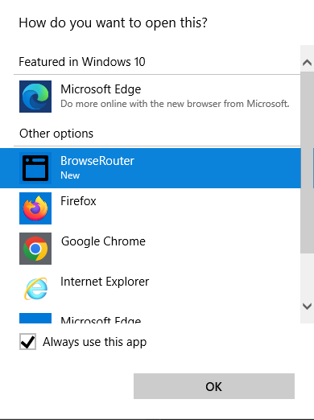
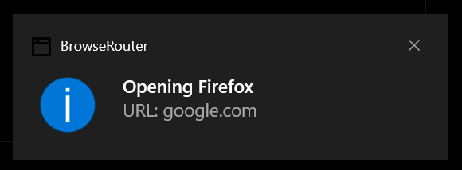

# BrowseRouter 

In Windows, launch a different browser depending on the url.

## Usage

```
    BrowseRouter.exe --register
        Register as a web browser.

    BrowseRouter.exe --unregister
        Unregister as a web browser.
        Once you have registered the app as a browser, you should use visit "Set Default Browser" in Windows to set this app as the default browser.

    BrowseRouter.exe http://example.org/
        Launch a URL
```


## Support

If you like BrowseRouter, let me know in [a discussion](https://github.com/nref/BrowseRouter/discussions/new?category=general). I work a full time job. BrowseRouter is just a hobby. You can help support continued development by "buying me a coffee."

<a href="https://www.buymeacoffee.com/slater1" target="_blank"></a>

You can help determine what happens next with BrowseRouter by filling out [this survey](https://forms.gle/Bh5z472CZUN6qdon9).

## Why?

`BrowseRouter` becomes your default "browser". When you click a link, it decides which real browser to launch. If you have multiple browsers installed, this is very useful. Example use cases:

- *Compatibility*. Some sites you visit work better in specific browsers. You don't care which browser opens, just that the loaded page works.
- *Privacy*. For example, one browser is configured to use a proxy while another isn't. 
- *Workplace*. You access an intranet site through a specific browser while you prefer to use another browser for the rest of the internet. 
- *Browser wars*. You're tired of browsers jostling to be the default. You're tired of changing the default browser.

## Security

`BrowseRouter` is clean software. I, [@nref](https://github.com/nref/), rest my reputation on it.

- The code is open-source and publicly reviewable. 
- I provide pre-built binaries whichs are cryptographically signed with an Extended Validation code-signing certificate. What that means is I regularly navigate a lot of bureaucracy which keeps me legally accountable, and I pay DigiCert a lot of money to verify my identity and purpose. Moreover, you can know that the binaries are from me and not modified by some middleman.
- If you don't trust the the binaries, you can build them from source. 
- Windows Defender currently reports no problems, as of version 0.8.0.0
- A small number of malware scanners are reporting false positives as of version 0.8.0.0. I cannot do much about these as the scanners do not provide specific complaints.
  - [65/68 VirusTotal Report for x64](https://www.virustotal.com/gui/file/a83b01de823c3698af768d51903aa6d6cbbc04dc965e6626e748e877cdbb33a9)
  - [66/68 VirusTotal Report for arm64](https://www.virustotal.com/gui/file/498b0a33f6508613a2e8c2592586dccad78d83e434542e0191cf8d28c900acfb)
- Possible reasons a scanner may not like BrowseRouter:
  - It adds registry keys. It must in order to register as a browser. 
  - It launches other browsers.

## Privacy

BrowseRouter contains no tracking, and it makes no network connections of its own whatsoever. 

Your system administrator could know which pages you are visiting by auditing process start logs e.g. `BrowseRouter.exe http://some-naughty-site.example`. They would have the same information for any browser.

## Credit

This is a fork of [BrowserSelector](https://github.com/DanTup/BrowserSelector/). That version is no longer mantained. This version carries on the vision, fixing bugs and adding new features.

## Setting Up

1. Clone and extract to a folder somewhere on your PC.
2. Open `config.ini` and customize paths to your browsers and domain patterns (see below).
3. *As administrator*, Run `BrowseRouter.exe --register` from this folder to register the tool in Windows as a web browser.
4. Open default browser chooser: from the Start Menu, search for "default browser" or "default apps". Select `BrowseRouter` as the default browser.
  - 
5. The first time you click on a link after registring BrowseRouter as a browser, you may be presented with the Open With dialog.
  - 

## Supported Platforms

- Windows 10 Pro
- Windows 11 Pro, x64
- Windows 11 Pro, arm64

## Notifications

By default, `BrowseRouter` will show a desktop notification when it opens a link. You can disable this in `config.ini`.



## Config

Config is a poor man's INI file:

```ini
[notify]
# Show a desktop notification when opening a link. Defaults to true
enabled = true

[log]
# Write log entries to a file. Defaults to false
enabled = true
# Defaults to C:\Users\<user>\AppData\Local\BrowseRouter\yyyy-MM-dd.log
#file = "C:\Users\<user>\Desktop\BrowseRouter.log"

# Default browser is first in list
# Use `{url}` to specify UWP app browser details
[browsers]
ff = C:\Program Files\Mozilla Firefox\firefox.exe
# Open in a new window
#chrome = "C:\Program Files (x86)\Google\Chrome\Application\chrome.exe" --new-window
chrome = C:\Program Files (x86)\Google\Chrome\Application\chrome.exe
edge = C:\Program Files (x86)\Microsoft\Edge\Application\msedge.exe

# Url preferences.
# - Only * is treated as a special character (wildcard).
# - Only domains are matched. Don't include protocols e.g. "https://" or paths e.g. "/some/path?query=value"
# - Beware that subdomains don't match automatically, e.g. "youtube.com = chrome" would not launch Chrome for "www.youtube.com"
#   For that reason, you'll often want a leading "*." e.g. "*.youtube.com". 
#   Note: Don't use "*youtube.com" as that would also match e.g. "notyoutube.com".
[urls]
*.google.com = chrome
*.youtube.com = chrome
*.visualstudio.com = edge
*.mozilla.org = ff

# Source preferences.
# Only * is treated as a special character (wildcard).
# Matches on window title of application used to open link.
# Applied regardless of any url preference match.
[sources]
* - Notepad = ff
Slack | Test = chrome
# Default case. Added automatically
# * = whatever
```

### Browsers

- Browsers must either be in your path or be fully-qualified paths to the executable e.g. `C:\Program Files (x86)\Google\Chrome\Application\chrome.exe`.
- Arguments are optional. However, if you provide arguments the path _must_ be enclosed in quotes. For example, `"chrome.exe" --new-window`
- If there are no arguments, then the paths do not need to be quoted. For example, `chrome.exe` will work.

### Sources

- You can optionally specify a "source preference" which matches the window title of the application used to open the link.
  - For example, with this in the previous example `config.ini`:

    ```ini
    [sources]
    *Microsoft Teams* = ff
    ```

    Then clicking a link in Microsoft Teams will open the link in Firefox, regardless of the URL.

- In the case of a conflict between a source preference and a URL preference, the source preference wins.

### Urls

There are two ways to specify an Url. You can use simple wildcards or full regular expressions.

**Simple wildcards:**

    microsoft.com = ie
    *.microsoft.com = ie

- Only `*` is treated as a special character in URL patterns, and matches any characters (equivalent to the `.*` regex syntax).
- Only the domain part (or IP address) of a URL is checked.
- There is no implied wildcard at the start or end, so you must include these if you need them, but be aware that "microsoft.\*" will not only match "microsoft.com" and "microsoft.co.uk" but also "microsoft.somethingelse.com".

**Full regular expressions:**

```regex
  /sites\.google\.com/a/myproject.live\.com/ = chrome
```
- Full regular expressions are specified by wrapping it in /'s.
- The domain _and_ path are used in the Url comparison.
- The regular expression syntax is based on the Microsoft .NET implementation.

### Sources

Wildcards and full regular expressions may also be used to match source window titles.

## Logs

Logs are stored by default in `%localappdata%/BrowseRouter/`. For example, if you user name is `joe`, then the logs will be in `C:\Users\joe\AppData\Local\BrowseRouter\`.

You can change the directory in the `[log]` section of `config.ini`.

You can enable disable or log files by setting `enabled = true` or `false` in the `[log]` section of `config.ini`.
If `enabled` is missing or doesn't equal `true`, logs will not be written.

Log entries are also written to the console and can be seen if e.g. if launched from Command Prompt, PowerShell, or Windows Terminal.